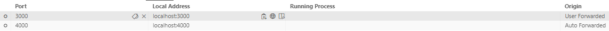

# `Onclusive Prompt Manager App`

## 1 Overview
The Onclusive Prompt Manager App is split into two componenets. The `prompt-frontend` and `prompt-backend`. Prompt frontend component is responsible for the UI of the application and communicates
with the `prompt-backend` for the UI features to function. The backend is our API and backbone of the UI application. It handles prompts created by the user (CRUD) as well as run inference with the given prompt on a chosen models.

Code for the backend can be found in `ml-mesh/apps/prompt/backend` (Python)

Code for the frontend can be found in `ml-mesh/apps/prompt/frontend` (Typescript)


## 2 Building the containers

To locally build the prompt-backend image tagged as
`063759612765.dkr.ecr.us-east-1.amazonaws.com/prompt-backend:$IMAGE_TAG`, run the following command:

```
make apps.build/prompt COMPONENT=backend ENVIRONMENT=dev IMAGE_TAG=$IMAGE_TAG
```

To locally build the prompt-frontend image tagged as
`063759612765.dkr.ecr.us-east-1.amazonaws.com/prompt-frontend:$IMAGE_TAG`, run the following command:

```
make apps.build/prompt COMPONENT=backend ENVIRONMENT=dev IMAGE_TAG=$IMAGE_TAG
```

Note, if you haven't exported a value for `IMAGE_TAG`, the image will be tagged as `latest`. To avoid this, initalise your `.envrc` by running `. .envrc` (have to be in same directory) or run `direnv allow`

## 3 Running the containers

To run the `prompt-backend` container, use the following command:

```
make apps.start/prompt COMPONENT=backend ENVIRONMENT=dev
```

Similarly, for `prompt-frontend`

```
make apps.start/prompt COMPONENT=frontend ENVIRONMENT=dev
```

If you were to run `docker ps` you will see various containers starting including `dyanmodb` as database and `redis` for caching:


You can find out more on how these containers start in [docker-compose.dev.yaml](https://github.com/AirPR/ml-mesh/blob/chore/add-prompt-readme/apps/prompt/docker-compose.dev.yaml)

### 3.1 Portforwarding
Now that your containers are running, you should be able to load up the Prompt Manager App webpage using `http://localhost:3000/prompt`.
If you are not able to, you need to portforward the left out container. To do that on VSCode:
- Click on `PORTS` which is by the bottom window next to the terminal tab
- Click Add Port
- Enter the missing port (most likely `3000`)

The ports tab should look like this once done


Refresh your browser and you should be able to load up the UI at `http://localhost:3000/prompt`

Now you are fully ready to interact with the Prompt App!

## 4 Running Backend tests

To run unit tests on `prompt-backend`, use the following command:

```
make apps.unit/prompt COMPONENT=backend ENVIRONMENT=dev
```

To run integration tests on `prompt-backend`, use the following command:
```
make apps.integration/prompt COMPONENT=backend ENVIRONMENT=dev
```

## 4 Deploying Images to ECR

To push your images to ECR you need to first authenticate to our Amazon ECR registry which is done by running:

```
make docker.login
```

To push the backend image to ECR run the following:

```
make apps.deploy/prompt COMPONENT=backend
```


Similarly for the frontend image:

```
make apps.deploy/prompt COMPONENT=frontend
```
