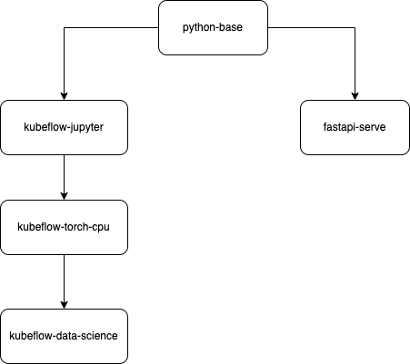

# Core docker images

Core docker images are the base images used to power our projects and development environments.

## Images

Images are provided as a way to have a tight dependency management control from development to production. Often, Deep learning libraries rely on low level components
that can be unstable to manage from one version to another.
Moreover, any breaking changes in any of our dependencies should be caught early on.

## Dependency management

These images share the same base, and python dependencies are managed in a way that they are tightly coupled from one environment to another.

All images that require a `pip-install` have dependencies manged via dependabot and updated every month.

## Images lineage

## Upcoming work

These images only cover some of our usecases. More work needs to be done to support core images for training and serving leveraging specialized hardware (GPU and Neuron).

## Make targets
