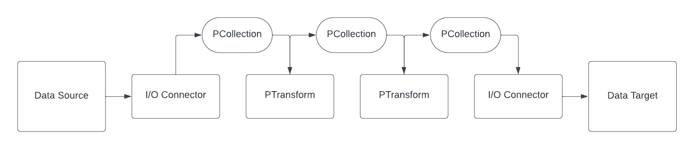

# The `backfill` component

This document outlines how to run your project's `backfill` component.


## Apache beam

At the inception of the project, beam had quite an ambitous goal: being a unified framework to manage data pipelines at scale by abstracting away execution concerns from the design of a pipeline.

At its core, beam allows to write pipeline in a language selected among Java, Python, Go and Typescript and abstract away any concert of scalability to the user. This is done by defining a simple yet powerful programming model:

- a `PCollection` is an unordered itrable of elements. It is most likely an homogeneous data set or data stream
- a `PTransform` represents a data processing operation and a step in a pipeline. Some PTransforms only read inputs. They are refered to as I/O connectors.
- a `Pipeline` is a succession of `PTransform`s passing `PCollection`s to one another. This defines an entire data processing job.



From our point of view, most of our work in Beam is to write data processing jobs subclassing `PTransform`.


## Beam + Flink

Beam pipelines are written using SDKs. We use the python SDK, and leverage Apache Flink as a runner. In the Beam echosystem a runner is a software that accepts
a pipeline and executes it.  Most runners are translators or adapters to massively parallel big-data processing systems, Flink being one of them.
This writing code in Beam we can leverage a large scale data processing framework such as Flink without having to know anything about the underlying system.


### Run the dev environment

Our dev environment is designed to replicate closely the production enviromment. It is made of the following services:

- backfill: container that submits the job to the jobserver and also runs the code
- jobmanager: Flink jobmanager. Receives the pipeline from the jobserver and distributes the work to the taskmanager.
- taskmanager: scalable execution engine.
- jobserver: translates the Beam python pipeline to a Flink pipeline.
- kafka: kafka broker to replicate Kafka input and output topics.
- zookeeper: backend for Kafka.


#### Prerequisites

Build the beam-backfill image using:

```
make docker.build/beam-backfill
```

#### Running the dev environment

to start the dev environment:

```
make projects.start/${PROJECT_NAME} COMPONENT=backfill
```

NOTE: the Flink task manager has a limited amount of resources, so it's also good practice to stop and restart the services periodically.


```
make projects.stop/${PROJECT_NAME} COMPONENT=backfill && make projects.start/${PROJECT_NAME} COMPONENT=backfill
```

#### Sending Kafka events

When your service is running, you can experiment with the pipeline by sending a dummy message:

```python
from confluent_kafka import Producer
import json

p = Producer({"bootstrap.servers": "localhost:9094"})
p.produce("beam-input", key="identifier", value=json.dumps({"content": "Google is a tech company", "language": "en"}))
```

and check if the enriched document is available in the target topic as follows:


```python
from confluent_kafka import Consumer
c = Consumer({'bootstrap.servers': 'localhost:9094','group.id': 'mygroup','auto.offset.reset': 'earliest'})
c.subscribe(['beam-output'])
c.poll().value().decode('utf-8')
```
