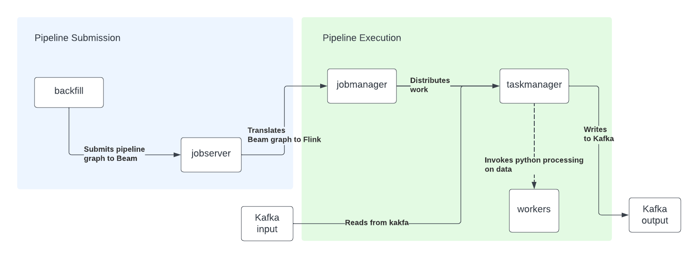

# NER backfill

Implementation of the NER model backfill container.


## Apache beam

At the inception of the project, beam had quite an ambitous goal: being a unified framework to manage data pipelines at scale by abstracting away execution concerns from the design of a pipeline.

At its core, beam allows to write pipeline in a language selected among Java, Python, Go and Typescript and abstract away any concert of scalability to the user. This is done by defining a simple yet powerful programming model:

- a `PCollection` is an unordered itrable of elements. It is most likely an homogeneous data set or data stream
- a `PTransform` represents a data processing operation and a step in a pipeline. Some PTransforms only read inputs. They are refered to as I/O connectors.
- a `Pipeline` is a succession of `PTransform`s passing `PCollection`s to one another. This defines an entire data processing job.


From our point of view, most of our work in Beam is to write data processing jobs subclassing `PTransform`.


## Beam + Flink

Beam pipelines are written using SDKs. We use the python SDK, and leverage Apache Flink as a runner. In the Beam echosystem a runner is a software that accepts
a pipeline and executes it.  Most runners are translators or adapters to massively parallel big-data processing systems, Flink being one of them.
This writing code in Beam we can leverage a large scale data processing framework such as Flink without having to know anything about the underlying system.


### Run the dev environment

Our dev environment is designed to replicate closely the production enviromment. It is made of the following services:

- backfill: container that submits the job to the jobserver and also runs the code
- jobmanager: Flink jobmanager. Receives the pipeline from the jobserver and distributes the work to the taskmanager.
- taskmanager: scalable execution engine.
- jobserver: translates the Beam python pipeline to a Flink pipeline.
- kafka: kafka broker to replicate Kafka input and output topics.
- zookeeper: backend for Kafka.




#### Prerequisites

Build the beam-backfill image using:

```
make docker.build/beam-backfill
```

#### Running the dev environment

to start the dev environment:

```
make projects.start/topic-summarization COMPONENT=backfill
```

NOTE: the Flink task manager has a limited amount of resources, so it's also good practice to stop and restart the services periodically.


```
make projects.stop/topic-summarization COMPONENT=backfill && make projects.start/topic-summarization COMPONENT=backfill
```

#### Sending Kafka events

When your service is running, you can experiment with the pipeline by sending a dummy message:

```python
from confluent_kafka import Producer
import json

p = Producer({"bootstrap.servers": "localhost:9094"})
p.produce(
    "beam-input",
    key="identifier",
    value=json.dumps(
        {
            "content": [
                "India's semiconductor component market will see its cumulative revenues climb to $300 billion during 2021-2026, a report said Tuesday. The ‘India Semiconductor Market Report, 2019-2026', a joint research by the India Electronics & Semiconductor Association (IESA) and Counterpoint Research, observed that India is poised to be the second largest market in the world in terms of scale and growing demand for semiconductor components across several industries and applications. It added that this was being bolstered by the increasing pace of digital transformation and the adoption of new technologies and covers smartphones, PCs, wearables, cloud data centers, Industry 4.0 applications, IoT, smart mobility, and advanced telecom and public utility infrastructure. “While the country is becoming one of the largest consumers of electronic and semiconductor components, most components are imported, offering limited economic opportunities for the country. Currently, only 9% of this semiconductor requirement is met locally,” the report said. it noted that India's end equipment market in 2021 stood at $119 billion in terms of revenue and is expected to grow at a CAGR of 19% from 2021 to 2026. It said that the Electronic System Design and Manufacturing (ESDM) sector in India will play a major role in th country's overall growth, from sourcing components to design manufacturing. “Before the end of this decade, there will be nothing that will not be touched by electronics and the ubiquitous ‘chip, '” IESA CEO Krishna Moorthy said. “Be it fighting carbon emissions, renewable energy, food safety, or healthcare, the semiconductor chip will be all-pervasive.",
                "Counterpoint Research vice president Neil Shah added that consumption will not only come from the advanced semiconductor-heavy 5G and fiber-to-the-home (FTTH) network infrastructure equipment, which will contribute to more than 14% of the total semiconductor consumption in 2026, but also from the highly capable AI-driven 5G endpoints, from smartphones, tablets, PCs, connected cars, industrial robotics to private networks. “The telecom sector with the advent of 5G and fiber network rollout will be a key catalyst in boosting the semiconductor components consumption,” Shah said. “Also, ongoing efforts to embrace cleaner and greener vehicles (electric vehicles) will provide an impetus for the automobile industry to adopt advanced technologies, which in turn will boost the demand for semiconductor components in India.”He also believed that consumer electronics, industrial, and mobile and wearables will be the other key industries for the growth of the semiconductor market in India. Further, this semiconductor demand will not only be driven by domestic consumption but also by the growing share of exports. Mobile and wearables, IT and industrial sectors alone contributed to almost 80% of the semiconductor revenues in India in 2021, the research found. Tarun Pathak, research director at Counterpoint Research, said the gradual shift from feature phones to smartphones has been generating increased proportions of advanced logic processors, memory, integrated controllers, sensors and other components. “This will continue to drive the value of the semiconductor content in smartphones, which is still an under-penetrated segment in India, aided by the rise of wearables such as smartwatch and TWS,” he said.",
            ]
        }
    ),
)
p.flush()
```

and check if the enriched document is available in the target topic as follows:


```python
from confluent_kafka import Consumer
c = Consumer({'bootstrap.servers': 'localhost:9094','group.id': 'mygroup','auto.offset.reset': 'earliest'})
c.subscribe(['beam-output'])
c.poll().value().decode('utf-8')
```
